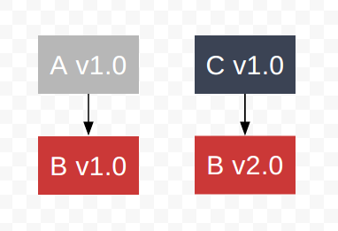
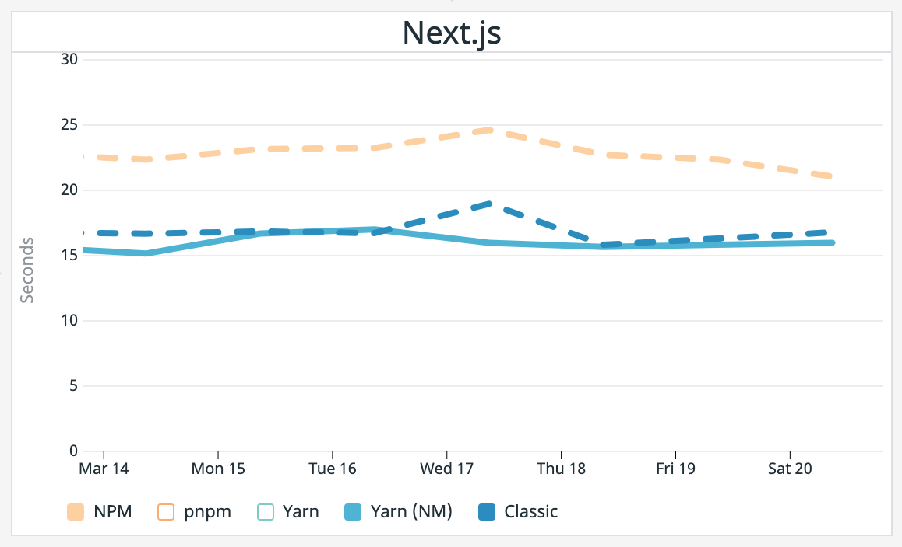

## npm

Yahoo 에서 일하던 [Isaac Z. Schlueter](https://github.com/isaacs) 는 자바스크립트를 매우 좋아하던 개발자였다. 그 당시 프론트엔드에서 자바스크립트를 쓰고 있었지만 서버사이드에선 다른 언어를 써야 했고 Issac 은 두 환경 모두에서 자바스크립트를 쓰고 싶었다. 사람들은 어떻게 자바스크립트를 서버사이드용으로 개발할 수 있을지 고민했고 2009년 [Ryan Dahl](https://github.com/ry) 이 자바스크립트 런타임인 Node.js 를 개발하면서 드디어 서버사이드에서도 자바스크립트를 사용할 수 있게 되었다.

Node.js를 사용하기 시작한 Issac 은 다른 사람들이 만든 모듈을 여러 곳에서 사용하다가 사람들이 모듈 관리에 어려움을 느끼고 있다는 것을 깨닫고 Ryan 에게 [패키지 매니저에 관한 제안을 하게 된다.](https://groups.google.com/g/nodejs/c/erDWyS4xPw8)

> *제 생각엔 Node.js에게 패키지 매니저가 필요할 것 같습니다. 굉장히 유용한 모듈들이 많이 있지만, 실제로 여러개의 모듈을 같이 사용하는 것이 힘듭니다.*


그렇게 2010년 1월 npm이 탄생했다. npm 은 다음과 같은 문제들을 해결하는데 집중했다.

* 여러 버전의 동일한 패키지를 한 프로젝트에서 사용할 수 있게 하자.
* 설치 방식을 통일하자. (`npm install some-package`)
* 패키지 관련정보가 들어있는 메타 데이터를 간소화하자. (`package.json`)
* 누구나 배포할 수 있도록 하자.

이런 기능들을 바탕으로 npm 은 엄청난 성장을 거듭했고 매년마다 패키지 다운로드 수는 증가했다.


npm 은 Node.js에서 사용하는 [node-semver](https://github.com/npm/node-semver) 을 사용, [유의미 버전](https://semver.org/lang/ko/) 방식을 도입하여 major, minor, patch 버저닝을 통해 개발자들간의 버전 관리에 대한 방향성을 제공하였다. 하지만, 이 방법도 개발자간의 패키지가 다른 방식을 완전히 해결할 수는 없었다. **누구는 업데이트를 하고 누구는 업데이트를 하지 않았기 때문이다.** 이런 문제 때문에 당시의 의존성 정보를 정확하게 담고 있는 `npm-shrinkwrap.json` 이라는 파일을 수동으로 생성할 수 있었으나 수동인지라 여전히 관리는 힘들었다.

또한 "동일한 패키지의 다른 버전" 을 설치하는 문제는 해결하는데 있어서 아래와 같이 각 패키지가 자신만의 `node_modules` 를 가지게 하는 방식을 사용했기 때문에 패키지 중복 문제 및 경로가 매우 길어지는 문제가 발생하였다.



중복된 하위 패키지를 갖는 구조는 용량 및 설치 속도 측면에서 문제였고 아래와 같이 긴 경로는 경로 문자 수 제한이 있던 Windows 에서 문제를 발생시켰다.

```
./node_modules/package-A/node_modules/package-B/node_modules/package-C
```

이 방식은 npm v2 까지 지속되었으나, npm v3 부터 **공통 버전의 패키지는 플랫하게 처리하는** 방식으로 변경되었다. 만약 동일한 버전의 패키지를 사용하는 경우라면, 최상위에 위치하게 되며 다른 버전이라면 그제서야 해당 패키지의 하위에 위치하게 된다.


A가 B 1.0에 의존성을 갖고, C가 B 2.0에 의존성을 갖기 때문에 B 1.0을 최상위로 끌어 올리고 B 2.0을 C 하위에 두는 방식이다. 말 그대로 평평하게(flat) 만들 수 있는 패키지는 최상단으로 끌어올리는 방식이다. 이렇게 플랫하게 처리하는 방식으로 어느 정도의 패키지 중복 문제는 해결하였으나 **여전히 [의존성 트리가 달라지는 문제](https://npm.github.io/how-npm-works-docs/npm3/non-determinism.html) 가 있었다.**


## Yarn


2016년, Facebook, Google, Exponent, Tilde 가 합작하여 기존에 있었던 npm 의 여러가지 문제를 언급하면서 새로운 패키지 매니저인 [yarn 을 개발했다.](https://engineering.fb.com/2016/10/11/web/yarn-a-new-package-manager-for-javascript/) 이들은 npm 을 쓰면서 다음과 같은 문제를 느꼈다고 한다.

* lock 파일의 부재, 수동으로 생성해야 함
* 의존성 트리가 다를 수 있음
* 느린 퍼포먼스

위에서 언급했다시피 npm 에선 `npm-shrinkwrap.json` 이란 lock 파일을 수동으로 생성해야 하는 문제가 있었고 yarn 은 **`yarn.lock ` 파일을 자동으로 생성**하게끔 바꿔서 이러한 문제를 해결했다. 또한 npm 이 설치 순서에 따라 의존성 트리가 달랐던 문제는 lock 파일과 새로운 설치 알고리즘을 통해 신뢰성있고 일관적이게 생성되도록 개선하였다. 자동으로 생성되는 lock 파일은 각 패키지의 버전에 따른 체크섬(checksum) 값을 가졌기 때문에 어떤 환경에서든 해당 프로젝트의 사용자가 동일한 패키지를 설치하는 것이 가능하게 되었다.

npm은 패키지들을 순서대로 설치하는 방식을 사용하는 반면에 yarn 은 병렬적으로 설치해서 성능을 올렸고 오프라인 미러를 가지지 않았던 npm 이 오프라인 상황에서의 패키지 설치에 문제가 있었던 반면에 yarn 은 오프라인 미러를 둠으로써 오프라인 상황에서도 패키지를 설치하게끔 하였다. 이런 오프라인 미러가 중요한 이유는 그 유명한 [npm의 left-pad 문제](https://qz.com/646467/how-one-programmer-broke-the-internet-by-deleting-a-tiny-piece-of-code/) 와 같은 문제를 어느 정도는 방지 할 수 있기 때문이기도 했다.

[2016년 10월에 Alberto Varela라는 유저가 시도한 벤치마크](https://www.berriart.com/blog/2016/10/npm-yarn-benchmark/) 를 보면 확실히 그 당시에는 yarn 의 성능이 npm 에 비해 좋았다는 사실을 확인할 수 있다. 


추후 npm도 [npm v5](https://github.com/npm/npm/releases/tag/v5.0.0)에서 lock 파일인 `package-lock.json` 이 자동으로 생성되고 캐시가 아예 새로 쓰여지는 등의 업데이트가 있었고 계속해서 개선되어 왔다.  2021년 3월 현재 yarn의 공식 벤치마크([yarnpkg.com/benchmarks](https://yarnpkg.com/benchmarks)) 를 보면 Next.js 기준으로 패키지를 처음 설치할 때 아래와 같이 `node_modules` 가 설치된 yarn(*Yarn(NM)*) 과 그렇지 않은 yarn(*classic*) 이 npm을 앞선 상태이다.




**하지만 두 패키지 매니저 모두 근본적으로 해결할 수 없는 문제들이 있었다.**

* 모듈들은 자신의 직접적으로 의존하지 않는 패키지들을 사용할 수 있음 ([Phantom Dependencies](https://rushjs.io/pages/advanced/phantom_deps/))
* 의존성 트리를 플랫하게 만드는 알고리즘이 굉장히 복잡함
* 캐시에서 프로젝트의 `node_modules` 에 복사되어야 함 (무거운 I/O 연산)

이러한 문제들이 여전히 있었기 때문에 yarn 이 나오고도 실망한 사람들이 있었고 그 중 한 명이었던 [Zoltan Kochan](https://github.com/zkochan) 은 아예 새로운 메커니즘으로 패키지 매니저를 개발하기로 결심한다.


## pnpm


<br>

2017년 1월 그렇게 pnpm이 세상에 나오게 된다. pnpm 은 npm v2에서 사용하던 패키지 처리방식을 차용하기로 하는데, 각 패키지가 각자의 `node_modules` 를 가지는 구조이다. 대신, npm 처럼 깊어지진 않고 **symbolic link 를 사용해서 플랫하게 처리** 하여 완전한 플랫형 구조를 가지게 된다.

 한 번 예를 들어 보자. 구조를 비교하기 위해 리액트 17을 의존성으로 갖는 `react-17-package` 와 16을 의존성으로 갖는 `react-16-package` 를 npm 에 publish 했다. 이 2개의 패키지를 yarn 으로 설치했을 때 다음과 같은 구조를 갖는다.

```
node_modules
  - react 16
  - react-16-package
  - react-17-package
    - node_modules
      - react 17
```

이외에도 리액트가 갖는 의존성 패키지들이 있지만 이는 생략하고 간단하게 표현하였다. 위 구조를 보면 npm v3 에서 사용하는 플랫 방식을 사용하고 있고 동일한 버전의 다른 패키지인 경우 하위의 `node_modules` 로 가지게 된다. 이제 이를 pnpm 으로 나타내보자.

```
node_modules
  - .pnpm
    - node_modules
      - react 16
      - react 17
      - react-16-package
        - node_modules/react 16 (symlink → ../../react 16)
      - react-17-package
        - node_modules/react 16 (symlink → ../../react 17)
  - react-16-package (symlink → ../.pnpm/node_modules/react-16-package)
  - react-17-package (symlink → ../.pnpm/node_modules/react-17-package)
```

확실히 구조의 차이가 느껴진다. 먼저 `node_modules` 에는 직접적인 의존성에 해당하는 패키지들만을 가지고 이는 `.pnpm/node_modules` 에 symbolic link 로 연결된다. 또한 `.pnpm/node_modules` 안에서는 모든 패키지가 플랫하게 설치되며 서로의 의존성을 띄고 있는 경우 이 또한 symbolic link 로 연결된다. 더 놀라운 점은 `.pnpm/node_modules` 의 패키지 파일들은 실제 원본 파일이 아닌 `~/.pnpm-store` 에 있는 패키지 파일들의 hard link 라는 점이다. 이건 기존에 캐시에서 `node_modules` 로 복사하는 과정을 개선한 점으로 만약 설치한 패키지가 1MB 를 차지한다면 기존에는 2MB 를 차지하는게 되지만 pnpm 에선 hard link 이기 때문에 동일하게 1MB 만을 차지하는 것이다.

이렇게 pnpm 은 phantom dependencies 문제, 100% 플랫하지 않은 의존성 트리 문제를 해결했고 아래의 벤치마크 처럼 상당한 퍼포먼스 개선을 이루어냈다. 위에서 본것과 마찬가지로 아래 벤치마크에서 2021년 3월 현재 기준으로 많은 부분에서 pnpm 이 앞서고 있다는 것을 확인할 수 있다.


그러나 pnpm도 여전히 다른 문제를 가지고 있긴 하다.

* 동일한 파일 시스템에서만 사용할 수 있는 hard link 의 문제 때문에 C 드라이브에서 되던 패키지 설치가 D 드라이브에선 깨질 수 있다.
* FAT32 와 같은 파일 시스템에선 hard link/symbolic link 지원을 하지 않고 파일 감시 툴인 Watchman 에서 동작을 하지 않는다. (실제로 내부 툴로 Watchman 을 사용하는 Facebook 이 이것 때문에 [Yarn2 에서 이러한 메커니즘 사용하는 것을 포기했다.](https://github.com/yarnpkg/yarn/issues/499#issuecomment-251583225))


## Yarn 2 (berry)

> "Berry" is the codename for the Yarn 2 release line. 

2018년 9월 yarn 의 RFC 저장소에 [하나의 PR](https://github.com/yarnpkg/rfcs/pull/101)이 올라왔다. **`node_modules` 를 완전히 제거하자는 제안** 이었고 그 방법은 **PnP(Plug'n'Play)** 라는 메커니즘이었다. 이 메커니즘은 아래와 같은 문제들을 해결하기 위함이었다.

1. **Node.js의 기본적인 모듈 처리 메커니즘으로 인한 속도 저하**

Node.js는 어떤 모듈을 사용하려고 하면, 그 모듈을 찾기 위해 부모 ~ 루트까지 `node_modules` 폴더를 찾는 방식을 사용한다. 따라서 이걸 찾기 위해 시스템 함수를 호출함에 따라서 시간이 걸리며 이는 런타임에 시작 속도 저하를 발생시킨다.

2. **Yarn 의 설치 메커니즘으로 인한 속도 저하**

Yarn 은 패키지(모듈)를 설치할 때, 원격 저장소에서 패키지를 찾아 오프라인 미러에 저장하고 오프라인 미러에 있는 패키지를 캐시에 푼다. 그 다음 캐시에 있는 패키지를 `node_modules` 로 복사하는 방식을 사용한다. 이 과정에서 무거운 I/O 연산으로 인한 속도 저하가 발생한다.

3. **`node_modules` 자체가 실용적으로 설계되지 않았음**

많은 패키지 매니저들이 `node_modules` 에 설치되는 패키지들의 중복제거(dedupe)를 하지 못한다. 최적화를 통해서 호이스팅을 하기도 하지만 여전히 이 문제는 해결되지 않는 경우가 많다.

4. **Node.js 는 "패키지" 라는 개념에 대해 모름**

이 때문에, 어떤 파일들이 "접근 가능한지"와 어떤 파일들이 "끌어올려지는지"에 대한 판단이 불가능하다. 즉, 개발을 할 때는 동작을 했지만 프로덕션에서 의존성에 명시되어 있지 않기 때문에 깨질 수 있는 문제가 발생한다. 위에서 말했떤 Phantom dependencies 문제와 동일하다.

Berry 는 이러한 문제들을 해결하기 위해 **`.pnp.js` 라는 파일을 생성** 한다. 이 파일은 다음과 같은 정적인 정보들과 이러한 정보들을 통해 모듈 처리 방식을 구성한 자체 리졸버(resolver)를 갖는다.

- 의존성 트리에서 어떤 패키지들이 사용 가능한가
- 그 패키지들이 어떻게 연결되어 있는가
- 디스크 어디에 위치해 있는가

또한 `node_modules` 를 생성하지 않고 기본 캐시 폴더인 `yarn/cache` 에 패키지를 zip 파일로 저장해서 이 경로를 `.pnp.js` 에 명시하는 방식을 사용한다. 따라서, 노드는 `.pnp.js` 의 정보를 활용하여 기존 방식보다 훨씬 빠르게 어플리케이션의 패키지들을 설치 및 실행할 수 있게 되었다.`.pnp.js` 에 관련 패키지들이 모두 명시되어 있기 때문에 각 패키지들도 최상위로 끌어올려져서 완전히 플랫한 구조를 가지게 되었다. 더 자세한 내용은 [해당 RFC 파일](https://github.com/yarnpkg/rfcs/blob/master/accepted/0000-plug-an-play.md) 에서도 찾아볼 수 있다.

아무것도 없이 설치할 때 Berry(아래에서 *Yarn*)의 경우 npm과 비슷한 속도를 보이는데 이는 제일 처음에 각 패키지들을 가져올 때 더 빠른 [캐시 접근을 위해 `tgz` 포맷을 `zip` 으로 변환하는 과정](https://github.com/yarnpkg/berry/issues/673#issuecomment-572424129)에서 일어나는 퍼포먼스 비용 때문이다.


그러나 초기 설치 이후에 캐시와 lock 파일이 있는 경우는 pnpm 과 속도가 비슷하게 빨라진 것을 확인할 수 있다.


지금까지 봤을 때 Berry 가 모든 문제를 해결할 것 처럼 보이지만, 아직 안정적이지 않고 나온지 얼마 안되서 호환되는 패키지가 그렇게 많지 않다. 실제로, Facebook 에서도 Yarn PnP 사용하는 것을 일단 중단했다고 한다. 

<blockquote class="twitter-tweet"><p lang="en" dir="ltr">Unfortunately we&#39;ve had to disable <a href="https://twitter.com/yarnpkg?ref_src=twsrc%5Etfw">@yarnpkg</a> PnP at Facebook due to instability. We&#39;d recommend thorough testing before deciding to adopt it in your codebase.</p>&mdash; Sebastian (@sebmck) <a href="https://twitter.com/sebmck/status/1137059802838757377?ref_src=twsrc%5Etfw">June 7, 2019</a></blockquote> <script async src="https://platform.twitter.com/widgets.js" charset="utf-8"></script>

19년 6월의 트윗이라 현재는 어떨지 모르지만 호환성이 떨어지는 것은 사실이었다는 것을 확인할 수 있다. 그럼에도 불구하고, 기존의 패키지 설치 방식을 톺아본 결과로는 굉장히 합리적인 방법이라고 느껴진다. 앞으로 개인 프로젝트에서 틈틈히 사용해보면서 경험을 많이 해봐야겠다.


## 마무리

지금까지 npm 부터 berry까지, 자바스크립트 패키지 매니저가 어떤 여정을 거쳐왔는지 살펴보았다. 각각의 패키지 매니저들을 엄청 깊게 파보진 않았지만 이 포스팅을 작성하면서 어떻게 발전했고 어느 부분에 장단점이 있었는지 알 수 있었다. 미래의 패키지 매니저들이 어떤 방향을 향해 나아가는지는 지켜봐야 하겠지만, 확실히 npm/yarn 의 구조에서 벗어났으면 하는 바람이 있다.

 로 생성한 깃헙 스타 트렌드")

현 시점에서, 깃헙 스타 수 현황을 보면 npm 은 어느 정도 멈췄고 yarn 이 굉장히 압도적으로 성장했다. pnpm 은 가파르진 않지만 꾸준하게 오르고 있고 그 뒤를 berry 가 따라가고 있다. 스타 수가 절대적인 척도는 아니지만 pnpm/berry 의 성장세가 그렇게 빠르진 않은 것 같다. 확실히 너무나도 많은 패키지들이 npm/yarn 의 방식을 따라갔다 보니 빠르게 뒤바뀌는 것도 이상하긴 하다. 어쨌든 2021년 이후 부터는 가파른 성장세를 타고 pnpm/berry 가 패키지 매니저 시장을 장악해 갔으면 좋겠다.


## 참고

* [Matt Goldwater, An abbreviated history of JavaScript package managers](https://medium.com/javascript-in-plain-english/an-abbreviated-history-of-javascript-package-managers-f9797be7cf0e#:~:text=Npm%2C%20released%20on%20January%2012,to%20work%20with%20global%20packages.)
* [George Lawton, The secret history behind the success of npm and Node](https://www.theserverside.com/blog/Coffee-Talk-Java-News-Stories-and-Opinions/The-secret-history-behind-the-success-of-npm-and-Node)
* [What is the difference between Bower and npm?](https://stackoverflow.com/questions/18641899/what-is-the-difference-between-bower-and-npm)
* [Facebook, Yarn: A new package manager for JavaScript](https://engineering.fb.com/2016/10/11/web/yarn-a-new-package-manager-for-javascript/)
* [Google group, Preview: npm, the node package manager](https://groups.google.com/g/nodejs/c/erDWyS4xPw8)
* [Glenn Fleishman, Interview with Isaac Z. Schlueter, CEO of npm](https://increment.com/development/interview-with-isaac-z-schlueter-ceo-of-npm/)
* [Zoltan Kochan, pnpm version 1 is out!](https://medium.com/pnpm/pnpm-version-1-is-out-935a07af914)
* [Zoltan Kochan, Why should we use pnpm](https://medium.com/pnpm/why-should-we-use-pnpm-75ca4bfe7d93)
* [Burak Yiğit Kaya, How Yarn PnP can save your space-time](https://www.youtube.com/watch?v=AFBYxQPq-2c)
* [Yarn RFC, Plug'n'Play Whitepaper](https://github.com/yarnpkg/rfcs/blob/master/accepted/0000-plug-an-play.md)
* [Yarn official benchmark site](yarnpkg.com/benchmarks)